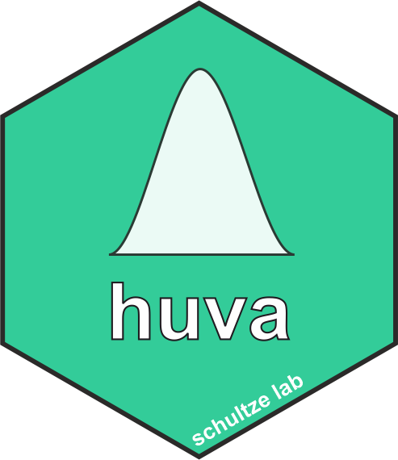

# huva (R)


Population-scale multi-layered datasets assemble extensive experimental data of different types on single healthy individuals in large cohorts, capturing genetic variation and environmental factors influencing gene expression with no clinical evidence of pathology. Variance of gene expression can be exploited to set up a conditional quasi loss- and gain-of-function “in population” experiment if expression values for the gene of interest (GOI) are available. We describe here a novel approach, called huva (human variation), that takes advantage of population-scale multi-layered data to infer gene function and relationships between phenotypes and gene expression. Within a reference dataset, huva derives two experimental groups, i.e. individuals with LOW or HIGH expression of the GOI, enabling the subsequent comparison of their transcriptional profile and functional parameters. We demonstrate that this approach robustly and efficiently identifies the phenotypic relevance of a GOI, allows the stratification of genes according to shared biological functions, and we further generalized this concept to almost 16,000 genes in the human blood transcriptome. Additionally, we describe how huva predicts the phenotype of naturally occurring activating mutations in humans. Here, huva predicts monocytes rather than lymphocytes to be the major cell type in the pathophysiology of STAT1 activating mutations, evidence which was validated in a cohort of clinically characterized patients.

## how to install *huva*
You can install *huva* from R with the following code:

```R
url <- "https://github.com/lorenzobonaguro/huva"

devtools::install_git(url = url)
```

We provide also [docker containers](weblink) with *huva* and all dependencies already pre-installed.

## Usage
For detailed information usage check the *huva vignette* and the documentation of each function

## How to cite *huva*
If you use *huva* in your research project consider citing us: [Human variation in population-wide gene expression data predicts gene function and phenotype; Bonaguro at al. 2022](weblink).

## Contact or follow us
For any problem of question regrding the *huva* package or this repository or you just want to be up to date on what is coming next, send us an [email](mailto:helphuva@uni-bonn.de) or follow us:  

  

[@LorenzoBonaguro](https://twitter.com/LorenzoBonaguro)  
[@AschenbrennerAC](https://twitter.com/AschenbrennerAC)  
[@LabSchultze](https://twitter.com/LabSchultze)